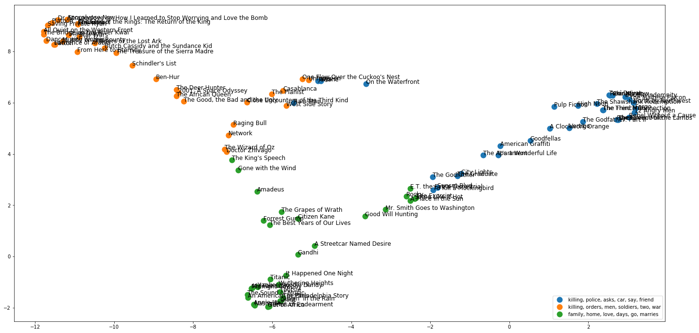
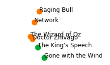

# Topic Modeling of Movie Synopses

In this project, we explore the hidden structures of 100 IMDB movies based on their synopses content.

With exploring amount of digital data today, it is critical to have an efficient mechanism to manage, search and process them. Otherwise, we are just cluttering up our storage space. Natural language processing (NLP) is an excellent tool box to process the digital text data. Topic modeling are unsupervised learning approaches to obtain not only document similarity but also hidden structures in the texts. 

In this project, we apply topic modeling by Latent Dirichlet Allocation (LDA)  to a dataset of synopses of [IMDB Top 100 Greatest Movies of All Time](https://www.imdb.com/list/ls055592025/). Below is the LDA result visualized by t-Distributed Stochastic Neighbor Embedding (t-SNE). We can see 100 movies are successfully into 3 categories.

In  the table below, we can easily induce the the hidden genre from the representative keywords and movies.

| Topic  | Top 4 keywords                 | Movie example                          | Hidden genre       |
| ------ | ------------------------------ | -------------------------------------- | ------------------ |
| Blue   | killing, police, asks, car     | 'The Godfather' & 'Pulp Fiction'       | Crime and action   |
| Orange | killing, orders, men, soldiers | 'Schindler's List' & 'West Side Story' | War                |
| Green  | family, home, love, days       | 'Gone with the Wind' & 'Titanic'       | Romance and family |

We also notice movies around the boundary can be a mixture of two topics For examples, the movies in the figure below are related to both 'war' and 'romance' if you have seen them. 

